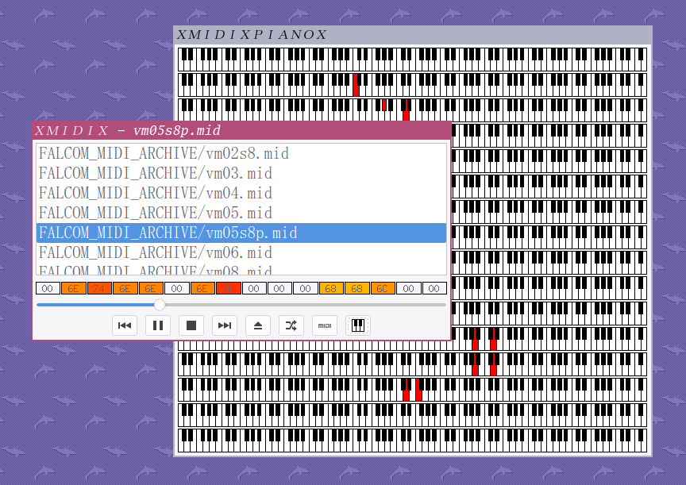

ＸＭＩＤＩＸ
=========
ＸＭＩＤＩＸ is a MIDI hardware device player for the X Window System not written in Rust.
dust off the SC-55, load up some MIDIs and hear the music in stunning fidelity the way the artist intended.

there are plenty of GUIs for playing MIDIs on softsynths but not too many for hardsynths.
ＸＭＩＤＩＸ was written to fill that gap.

## ＲＥＱＵＩＲＥＭＥＮＴＳ
ＸＭＩＤＩＸ requires the following libraries:
 * Qt5
 * spdlog
 * fmt
 * asound2

## ＫＥＹＢＯＡＲＤ　ＳＨＯＲＴＣＵＴＳ
 * `SPACE` - play/pause
 * `CTRL + o` - load files
 * `CTRL + SPACE` - stop
 * `CTRL + p` - configuration
 * `CTRL + LEFT` - previous
 * `CTRL + RIGHT` - next

## ＴＲＯＵＢＬＥＳＨＯＯＴＩＮＧ
### ＴＨＥＲＥ　ＩＳ　ＮＯ　ＳＯＵＮＤ
ＸＭＩＤＩＸ is a MIDI hardware device player so unless you have MIDI hardware
hooked up to your computer, nothing will happen. if you would like to use this
software with a softsynth, the author recommends [Fluidsynth](https://github.com/FluidSynth/fluidsynth)
with the [Windows](https://musical-artifacts.com/artifacts/713) soundfont.

### ＩＴ　ＳＯＵＮＤＳ　ＷＥＩＲＤ　ＡＦＴＥＲ　Ｉ　ＳＥＥＫ
you have likely skipped over control messages which set up the instruments, tempo, etc.
use sparingly.

### Ｉ　ＷＯＵＬＤ　ＬＩＫＥ　ＴＯ　ＲＥＣＯＭＭＥＮＤ　ＴＨＩＳ　ＴＯ　ＭＹ　ＦＲＩＥＮＤＳ　ＡＮＤ　ＦＡＭＩＬＹ　ＢＵＴ　Ｉ　ＤＯＮ’Ｔ　ＫＮＯＷ　ＨＯＷ　ＴＯ　ＰＲＯＮＯＵＮＣＥ　ＴＨＥ　ＮＡＭＥ
ＸＭＩＤＩＸ must not be spoken out loud but, should you choose to go against the author's wishes,
"X MIDI 10" or "10 MIDI 10" is acceptable.

### Ｉ　ＦＯＵＮＤ　Ａ　ＢＵＧ
nice.

### Ｉ　ＤＯＮ’Ｔ　ＨＡＶＥ　ＡＮＹＴＨＩＮＧ　ＴＯ　ＬＩＳＴＥＮ　ＴＯ
start [here](https://archive.org/details/FALCOM_MIDI)

### ＤＯＥＳ　ＴＨＩＳ　ＷＯＲＫ　ＯＮ　ＷＩＮＤＯＷＳ
the software was written for Linux but some users on the forum
have had luck with [getting it running on Windows](https://goatse.cx/).

## ＡＣＫＮＯＷＬＥＤＧＥＭＥＮＴＳ
ＸＭＩＤＩＸ uses the [Midifile](https://github.com/craigsapp/midifile) library for SMF parsing.
